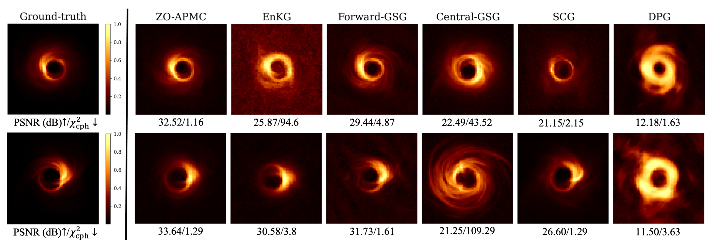

# Zeroth-Order Non-Log-Concave Sampling with Variance Reduction and Applications to Inverse Problems (ICML 2026)


## Abstract 

We propose a principled variance-reduced zeroth-order Langevin Monte Carlo (ZO-LMC) algorithm for sampling from non-log-concave distributions. We establish non-asymptotic convergence guarantees in Fisher information and weak convergence to the target distribution; under an additional Poincaré inequality assumption, we derive stronger non-asymptotic guarantees in squared Total Variation distance. Building on this framework, we propose ZO-APMC, a zeroth-order posterior sampling method with score-based generative priors for black-box inverse problems. We validate our theory through toy experiments and demonstrate strong empirical performance on derivative-free linear and nonlinear inverse problems, including MRI reconstruction, black-hole imaging, and Navier–Stokes problems.



## Prerequisities

- python 3.11.11
- pytorch 2.4.1
- CUDA 12.1
- Conda (recommended: Miniconda or Anaconda)

Additional package dependencies and exact environment specifications are provided in `env.yaml`. 

It may be possible to use different CUDA/PyTorch combinations provided they are compatible. 


## Getting Started 

### 1) Clone the repository

```bash
git clone https://github.com/mberk-sahin/zo-posterior-sampling.git

cd zo-posterior-sampling
```

### 2) Download pretrained checkpoint 

Download the checkpoint `fastmri_brain.pth` from [PnP-MonteCarlo](https://github.com/sunyumark/PnP-MonteCarlo). Then, specify the checkpoint path in the base configuration file `./configs/radial_mri/base_unet.yaml` by setting `init_score_fn_dir`.

### 3) Environment Setup

Create the Conda environment from the provided YAML file:

```bash
conda env create -f env.yaml
conda activate zo-apmc
```

### 4) Inference

To run the code, under the `main/` directory, run the following:

```bash
python run_pmc.py --config configs/radial_mri/zo_configs/p_0p2_pmcred_mri_lines=64_annealing.yaml
```

**Note:** Please add or configurate the data loader (`pmc/test_datasets/`) to allow proper loading of your own data. 


## Credits

The implementation of annealed Langevin Monte Carlo sampling in this repository is partially adapted from the publicly available [PnP-MonteCarlo](https://github.com/sunyumark/PnP-MonteCarlo) codebase. We acknowledge the original authors for their contribution and encourage readers to consult their repository and associated paper for additional methodological and implementation details.


## Citation 

If you find our work interesting, please consider citing 

```
@inproceedings{
sahin2026zerothorder,
title={Zeroth-Order Non-Log-Concave Sampling with Variance Reduction and Applications to Inverse Problems},
author={M. Berk Sahin and Behzad Sharif and Abolfazl Hashemi},
booktitle={Forty-third International Conference on Machine Learning},
year={2026},
url={https://openreview.net/forum?id=UlFOINq6SY}
}
```
